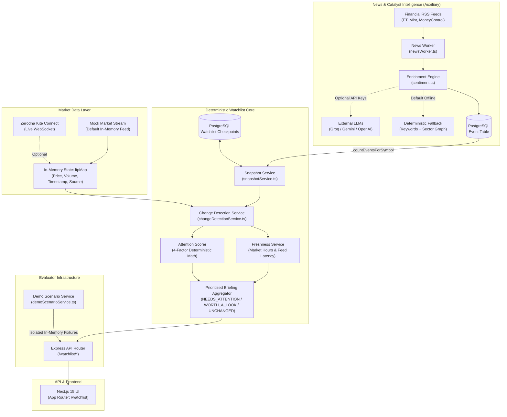

# Smart Market Watchlist

> **Know what changed while you were away — and why it matters.**

An independent engineering submission for the **Code, by Groww 2026** challenge (*Theme: Build a Smart Market Watchlist*).

*Note: This project is an independent hackathon submission and is not an official Groww product, nor is it affiliated with Groww.*

---

## What It Is & Why It Exists

Conventional market watchlists are **stateless and single-moment**. They show the current market price (LTP) and percentage change relative to the previous day's close ($T_{\text{open}} \rightarrow T_{\text{now}}$).

If an investor steps away for three hours and returns, a display showing `+0.4% today` conceals the real story:
- Did the stock plunge $-3.5\%$ on heavy volume and suddenly rebound?
- Did it sharply diverge from a falling NIFTY 50 benchmark?
- Did a critical regulatory notice or corporate earnings release break while they were away?

**Smart Market Watchlist is stateful.** It introduces **observation checkpoints** to answer the fundamental question:

> *"What meaningfully changed in my watchlist since I last checked — and what deserves my attention now?"*

The system computes state transitions relative to when the user was last active ($T_{\text{checkpoint}} \rightarrow T_{\text{now}}$), triages market noise from meaningful shifts, and generates prioritized, explainable briefings.

---

## How It Compares

| Dimension | Conventional Watchlist | Smart Market Watchlist |
| :--- | :--- | :--- |
| **Temporal Reference** | Previous day's close ($T_{\text{prev}} \rightarrow T_{\text{now}}$) | User's personal last-visited checkpoint ($T_{\text{checkpoint}} \rightarrow T_{\text{now}}$) |
| **Statefulness** | Stateless (same view for every user) | Stateful (persisted per-user checkpoints in PostgreSQL) |
| **Information Density** | Raw price ticks and percentage noise | Triage into 🔴 `NEEDS ATTENTION`, 🟡 `WORTH A LOOK`, ⚪ `UNCHANGED` |
| **Prioritization Model** | Sorting by 1D price gainers/losers | 4-Factor Attention Score (Price, Volume Pace, Benchmark Alpha, Catalysts) |
| **Noise Handling** | Every tick updates the display | Micro-fluctuations ($< 1.0\%$) grouped under Unchanged; hash-based continuity suppression |
| **Explainability** | Unexplained green/red numbers | Factual deterministic reason badges explaining *why* an item is flagged |
| **Freshness Intelligence** | Binary (Open vs Closed) | 5-state engine enforcing that settled sessions are valid (`MARKET_CLOSED != STALE`) |

---

## Core Workflow

```text
Current Market State (LTP, Volume, Timestamps)
                  ↓
User's Last Checkpoint (Persisted Baseline)
                  ↓
Meaningful Change Detection (ΔPrice, Volume Pace Ratio, Benchmark Alpha, Ingested Catalysts)
                  ↓
Multi-Factor Attention Scoring (0 - 100 Normalized Formula)
                  ↓
Priority Classification (🔴 NEEDS ATTENTION → 🟡 WORTH A LOOK → ⚪ UNCHANGED)
                  ↓
Deterministic Explanation (Category-Tagged Factual Reason Badges)
                  ↓
User Action ("Mark Checkpoint" Acknowledges State & Advances Baseline)
```

---

## Intelligence Architecture: Deterministic Core + News Signal Enrichment

The repository implements a **Hybrid Intelligence System** that cleanly separates deterministic decision logic from optional unstructured text analysis:

```text
┌──────────────────────────────────────────────────────────────────────────────────┐
│                      DETERMINISTIC WATCHLIST CORE                                │
│                                                                                  │
│   • Exact arithmetic delta detection (ΔP%, Volume Pace, Relative Alpha)          │
│   • Bounded 4-factor scoring model [0 - 100]                                     │
│   • Hard threshold priority classification (NEEDS_ATTENTION / WORTH_A_LOOK)      │
│   • Deterministic string-interpolated reason generation                          │
│   • Temporal freshness & session calendar evaluation                             │
│   • PostgreSQL atomic checkpoint transactions                                    │
└────────────────────────────────────────▲─────────────────────────────────────────┘
                                         │
                         Event Count (Integer: newEventCount)
                                         │
┌────────────────────────────────────────┴─────────────────────────────────────────┐
│                      NEWS & CATALYST ENRICHMENT PIPELINE                         │
│                                                                                  │
│   Financial RSS Feeds (Economic Times, LiveMint, MoneyControl, Business Std)     │
│                                        ↓                                         │
│   Background News Worker (60s Polling Scheduler)                                 │
│                                        ↓                                         │
│   Multi-Provider LLM Enrichment (Groq openai-oss-120b / Gemini / OpenAI)        │
│                                        OR                                        │
│   Deterministic Offline NLP Fallback (Keyword Scanner + Sector Knowledge Graph)  │
│                                        ↓                                         │
│   PostgreSQL Event Table (Deduplicated via SHA-256 Hash)                         │
└──────────────────────────────────────────────────────────────────────────────────┘
```

> **Important Distinction:**
> - The core watchlist is **not** an LLM wrapper. LLMs do not calculate scores, do not rank stocks, do not generate financial recommendations, and do not author the watchlist explanations.
> - **AI enriches the incoming event/news signal; deterministic domain logic makes the watchlist decision.**

---

## What Counts as a "Meaningful Change"?

A conventional watchlist treats every sub-tick price jitter as equal. Smart Market Watchlist uses multi-layered noise suppression and explicit significance thresholds to separate actionable events from routine volatility:

1. **Noise Suppression Threshold:** Price movements under $1.00\%$ without abnormal volume or corporate catalysts remain firmly categorized as ⚪ **`UNCHANGED`** with a low attention score.
2. **Direct Price Swing Override:** An absolute price swing $\ge 2.50\%$ since the checkpoint automatically promotes an instrument directly to 🔴 **`NEEDS_ATTENTION`**, regardless of other factors. Movements $\ge 1.00\%$ promote to 🟡 **`WORTH_A_LOOK`**.
3. **Volume Anomaly Gating:** Volume pace is evaluated as a ratio against the checkpoint baseline ($\frac{\text{Current Volume}}{\text{Checkpoint Volume}}$). Pace must exceed $1.0\times$ before contributing any points to attention scoring.
4. **Benchmark-Relative Alpha:** Movements are evaluated against the NIFTY 50 index over the same elapsed duration. A stock that rises $+1.5\%$ while NIFTY drops $-1.0\%$ exhibits $+2.5\%$ alpha divergence, earning higher attention than a stock moving in tandem with the broad market.
5. **Event Continuity Keying (`computeEventContinuityKey`):** A stable signature hashing `symbol:significance:bucketedChange:newEventCount` (with price rounded to 0.5% buckets). Minor continuous tick flutter does not generate false alerts or re-render churn.

---

## Mathematical Determinism & Core Concepts

A critical engineering requirement of Smart Market Watchlist is **100% mathematical reproducibility**. Given identical market inputs and the same historical checkpoint, the system must evaluate and categorize an instrument identically every single time — with zero stochastic drift, zero temperature variation, and strictly predictable outputs.

### The 4 Core Principles of Deterministic Design

1. **Checkpoint-Based Temporal Comparison ($T_0 \rightarrow T_1$):**
   A user checkpoint preserves market state frozen at timestamp $T_0$. Deltas are calculated relative to $T_0$ rather than previous day's close, ensuring that evaluations reflect specifically what occurred during the user's absence.
2. **Bounded Normalized Factor Spaces ($f \in [0.0, 1.0]$):**
   Each market dimension is scaled into a bounded, unitless range $[0.0, 1.0]$ with explicit saturation ceilings. This prevents extreme outliers (e.g. an illiquid stock with a $10\times$ volume spike) from distorting the composite score beyond its designated weight.
3. **Discrete Quantization & Noise Hysteresis:**
   Continuous price data is filtered through two deterministic gates:
   - **Noise Gate ($< 1.00\%$):** Fluctuations under $1.00\%$ are held in `UNCHANGED` unless supported by volume anomalies or corporate events.
   - **Continuity Binning ($0.5\%$ Buckets):** The alert signature hashes price changes into $0.5\%$ discrete intervals: $\text{bucket} = \frac{\text{round}(\Delta P\% \times 2)}{2}$. Minor sub-tick flutter ($+2.81\% \rightarrow +2.83\%$) produces an identical key, preventing UI re-render thrashing.
4. **Graceful Degradation for Incomplete Data:**
   The math never assumes false activity when data is missing:
   - If checkpoint volume was 0 or unrecorded, $V_{\text{ratio}} = \text{null}$, the volume factor evaluates strictly to $0.0$, and the UI outputs an explicit *"Baseline unavailable"* badge.
   - If benchmark index data is unavailable, alpha divergence evaluates to `null` and $0.0$ points without assuming outperformance or underperformance.

---

## Complete Mathematical Formulation & Deterministic Rules

The entire change detection and attention scoring pipeline is governed by the following equations implemented in [`attentionService.ts`](backend/src/services/watchlist/attentionService.ts) and [`changeDetectionService.ts`](backend/src/services/watchlist/changeDetectionService.ts):

### 1. Dimension Delta Calculations

$$\Delta P\% = \left(\frac{P_{\text{now}} - P_{\text{checkpoint}}}{P_{\text{checkpoint}}}\right) \times 100$$

$$V_{\text{ratio}} = \frac{V_{\text{now}}}{V_{\text{checkpoint}}} \quad \text{for } V_{\text{checkpoint}} > 0 \text{ and } V_{\text{now}} > 0 \;(\text{otherwise null})$$

$$\alpha = \Delta P\%_{\text{stock}} - \Delta P\%_{\text{benchmark}} \quad \text{if NIFTY 50 quote is available} \;(\text{otherwise null})$$

$$C = \sum_{e \in \text{Events}} \mathbf{1}_{\big[\text{symbol} \in e.\text{primarySymbols} \;\land\; e.\text{ingestedAt} \ge T_{\text{checkpoint}}\big]}$$

### 2. Factor Normalization Functions ($f \in [0.0, 1.0]$)

- **Normalized Price Factor ($40\%$ weight):**
  $$f_{\text{price}} = \min\left(1.0, \frac{|\Delta P\%|}{5.0}\right)$$
  *(Saturates at a $5.0\%$ price move)*

- **Normalized Volume Factor ($25\%$ weight):**
  $$f_{\text{volume}} = \min\left(1.0, \frac{\max(0, V_{\text{ratio}} - 1.0)}{2.0}\right) \quad \text{for } V_{\text{ratio}} > 1.0 \;(\text{otherwise } 0.0)$$
  *(Saturates at $3.0\times$ baseline pace; inactive if volume pace $\le 1.0\times$)*

- **Normalized Benchmark Alpha Factor ($20\%$ weight):**
  $$f_{\text{benchmark}} = \min\left(1.0, \frac{|\alpha|}{4.0}\right) \quad \text{for valid } \alpha \;(\text{otherwise } 0.0)$$
  *(Saturates at a $4.0\%$ relative divergence against NIFTY 50)*

- **Normalized Catalyst Factor ($15\%$ weight):**
  $$f_{\text{catalyst}} = \min\left(1.0, \frac{\max(0, C)}{2.0}\right)$$
  *(Saturates at $\ge 2$ new corporate or macro events)*

### 3. Composite Attention Score

$$\text{RawScore} = (40 \times f_{\text{price}}) + (25 \times f_{\text{volume}}) + (20 \times f_{\text{benchmark}}) + (15 \times f_{\text{catalyst}})$$

$$\text{Attention Score} = \max\Big(0, \min\big(100, \text{round}(\text{RawScore})\big)\Big)$$

### 4. Priority Triage Rules

Instruments are partitioned into three priority tiers based on deterministic boundary rules:

| Priority Tier | Classification Condition | Actionable Meaning |
| :--- | :--- | :--- |
| 🔴 **`NEEDS_ATTENTION`** | `Score >= 60` **OR** `|ΔP%| >= 2.5%` **OR** `C >= 2` | High-beta breakout, sharp plunge, severe volume surge, or corporate catalyst |
| 🟡 **`WORTH_A_LOOK`** | `Score >= 30` **OR** `|ΔP%| >= 1.0%` | Moderate trend shift, steady accumulation, or notable benchmark divergence |
| ⚪ **`UNCHANGED`** | All other instruments | Normal market noise ($< 1.0\%$); displayed compactly without visual alarm |

### 5. Event Continuity Signature

To eliminate client-side re-render churn across high-frequency tick jitter, continuous price changes are quantized into discrete $0.5\%$ buckets:

$$\text{ContinuityKey} = \text{Symbol} : \text{Tier} : \text{Bucket}(\Delta P\%) : C$$

$$\text{Bucket}(\Delta P\%) = \frac{\lfloor 2 \cdot \Delta P\% + 0.5 \rfloor}{2}$$

### 6. Temporal Freshness Evaluation Rules

Given elapsed quote age $\text{AgeSeconds} = \max\left(0, \lfloor (T_{\text{now}} - T_{\text{quote}}) / 1000 \rfloor\right)$:

| Freshness State | Condition | Confidence | Evaluator Interpretation |
| :--- | :--- | :---: | :--- |
| **`MARKET_CLOSED`** | Session is outside trading hours (weekend or after 15:30 IST) | Confident (`true`) | Official exchange closing prices; fully trustworthy for delta analysis |
| **`DATA_UNAVAILABLE`** | Active session, but quote timestamp $\le 0$ or zero feeds connected | Degraded (`false`) | Feed unavailable; evaluation suspended |
| **`LIVE`** | Active session and $\text{AgeSeconds} \le 5\text{s}$ | Confident (`true`) | Real-time market ticks streaming normally |
| **`DELAYED`** | Active session and $5\text{s} < \text{AgeSeconds} \le 30\text{s}$ | Confident (`true`) | Minor feed latency detected; ticks still flowing |
| **`STALE`** | Active session and $\text{AgeSeconds} > 30\text{s}$ | Degraded (`false`) | Stream dropped or frozen during regular trading hours |


---

## Checkpoints & Persistence

Checkpoints persist user state across browser sessions and devices using PostgreSQL via Prisma ([`snapshotService.ts`](backend/src/services/watchlist/snapshotService.ts)):

- **First Visit Baseline:** If a user accesses the watchlist for the first time with no stored checkpoint, the system snapshots current market prices and volumes, writes an initial checkpoint, and returns `isFirstVisit: true`. All items display baseline spot prices with `0.00%` delta and `UNCHANGED` status to eliminate phantom alerts.
- **Subsequent Return Visits:** On return visits, the backend loads the user's stored checkpoint from the `WatchlistCheckpoint` and `WatchlistCheckpointItem` tables, calculates the elapsed duration (e.g. *"2h 17m ago"*), and computes deltas against current market quotes.
- **"Mark Checkpoint" Action (`POST /watchlist/checkpoint`):** Acknowledges the current state. An atomic Prisma transaction updates `lastCheckedAt` to `now()` and replaces all checkpoint items with current prices and volumes.
- **User Isolation:** All checkpoints are scoped to the authenticated user ID (`userId` verified via JWT). Checkpoint mutations by one user never affect another.

---

## Market Freshness & Data Quality

The freshness evaluator ([`freshnessService.ts`](backend/src/services/watchlist/freshnessService.ts)) monitors feed latency against Indian market trading hours:

| State | Session & Timing | Confidence | Meaning |
| :--- | :--- | :---: | :--- |
| **`LIVE`** | Regular trading session (09:15–15:30 IST), quote age $\le 5\text{s}$ | Confident (`true`) | Real-time market ticks streaming normally. |
| **`DELAYED`** | Regular trading session, quote age between 5s and 30s | Confident (`true`) | Minor feed latency detected; ticks still flowing. |
| **`STALE`** | Regular trading session, quote age $> 30\text{s}$ | Degraded (`false`) | Stream dropped or frozen during active market hours; warning displayed. |
| **`MARKET_CLOSED`** | Outside NSE trading hours or weekend | Confident (`true`) | Official exchange closing prices; fully valid for delta comparison. |
| **`DATA_UNAVAILABLE`**| Regular trading session, zero ticker feeds connected | Degraded (`false`) | No market feed discoverable; delta evaluation suspended. |

### The Invariance Principle: `MARKET_CLOSED != STALE`
A closed market is **not** stale data. On weekends or after 15:30 IST, closing prices are settled, official exchange records. They are fully trustworthy and evaluated with high confidence (`canEvaluateConfidently: true`). Conversely, market-open status alone does not guarantee a live feed: if trading hours are active but quotes stop arriving, the engine flags the feed as `STALE`.

---

## Market Data Architecture

The application implements a dual-source market data architecture that decouples watchlist intelligence from external broker dependencies:

```text
Real Zerodha Kite Ticker (WebSocket) ──┐
                                       ├──► In-Memory State: ltpMap ──► Watchlist Core Engine
High-Fidelity Mock Stream (Default) ──┘    (Price, Volume, Timestamp)
```

1. **In-Memory LTP Map ([`portfolioService.ts`](backend/src/services/portfolioService.ts)):** An internal single source of truth storing `{ price, volume, timestamp, source }` per symbol. Watchlist services consume this map directly.
2. **High-Fidelity Mock Stream ([`kiteMockStream.ts`](backend/src/services/kiteMockStream.ts)):** The default operational mode (`MARKET_DATA_MODE=mock`). Starts automatically on boot, simulating price ticks, accumulated volumes, and random walks across Indian equities. Evaluators can clone and run immediately with zero broker credentials.
3. **Real Zerodha Kite Connect ([`kiteService.ts`](backend/src/services/kiteService.ts), [`streamHandler.ts`](backend/src/services/streamHandler.ts)):** Connects when credentials are provided (`MARKET_DATA_MODE=kite`), streaming live binary WebSocket ticks into `ltpMap`.

---

## News & Event Ingestion Pipeline

1. **Scraping:** Background worker ([`newsWorker.ts`](backend/src/workers/newsWorker.ts)) polls major Indian financial RSS feeds (`Economic Times`, `LiveMint`, `MoneyControl`, `Business Standard`) on a 60-second schedule.
2. **Enrichment:** Passes headline and summary to [`analyzeNewsAsync()`](backend/src/services/sentiment.ts):
   - **LLM Call (When Configured):** Calls Groq (`openai-oss-120b`), Gemini (`gemini-3.8-flash`), or OpenAI (`gpt-5.6-luna-medium`) with a 5-second timeout, extracting `eventType`, `primarySymbols`, `sentimentScore`, and second-order `rippleImpacts`.
   - **Offline Deterministic Fallback:** If API keys are absent or requests fail, executes [`analyzeNewsText()`](backend/src/services/sentiment.ts) using keyword dictionaries ([`SYMBOL_KEYWORDS`](backend/src/services/sentiment.ts)) and a hardcoded Indian market [`SECTOR_KNOWLEDGE_GRAPH`](backend/src/services/sentiment.ts).
3. **Persistence:** Saves enriched records to the PostgreSQL `Event` table, deduplicated via SHA-256 hash (`source:externalId`).
4. **Watchlist Link:** The watchlist snapshot service queries `countEventsForSymbol(symbol, checkpointDate)` to increment `newEventCount`.

---

## System Architecture



---

## Verified API Routes

All endpoints below are verified in [`backend/src/routes/watchlistChanges.ts`](backend/src/routes/watchlistChanges.ts):

| Route | Method | Access | Purpose |
| :--- | :---: | :---: | :--- |
| `/watchlist/summary` | `GET` | Authenticated | Returns the complete watchlist briefing comparing current market state against the user's stored checkpoint. |
| `/watchlist/checkpoint` | `POST` | Authenticated | Acknowledges current market state and atomically snapshots new prices and volumes into PostgreSQL. |
| `/watchlist/demo-scenario` | `POST`/`GET` | Public / Demo | Returns an in-memory, isolated evaluation fixture (`demoScenarioService.ts`) without touching database state. |

*(Note: On the `hackathon-scenarios` submission branch, additional `/watchlist/scenario` routes provide dynamic market simulation injection).*

---

## Deterministic Evaluator Infrastructure

To enable reproducible evaluation outside exchange trading hours or during quiet markets, the system includes isolated deterministic evaluator infrastructure ([`demoScenarioService.ts`](backend/src/services/watchlist/demoScenarioService.ts)):

| Component | Simulated Market State | What It Demonstrates |
| :--- | :--- | :--- |
| **Evaluator Demo Fixture** | Parameterized market divergence: `RELIANCE` rallies $+4.50\%$ (Score 84, $2.8\times$ volume pace, $+3.50\%$ alpha, 1 catalyst) into `NEEDS_ATTENTION`; `TCS` dips $-1.70\%$ into `WORTH_A_LOOK`; `INFY` and `HDFCBANK` stay `UNCHANGED`. | Verifies multi-factor scoring, direct promotion thresholds, volume pace anomaly weighting, and explainable reason badges. |
| **Interactive Scenario Controller** | 6 live market scenarios (`baseline`, `big_move`, `volume_spike`, `stale`, `market_closed`, `unchanged`). | Available on the **`hackathon-scenarios`** submission branch with an interactive live scenario switcher toolbar. |

*Note: Evaluator scenarios are isolated testing fixtures and do not mutate real user database checkpoints.*

---

## Judge Demo Quickstart (< 2 Minutes)

Evaluators can test the core workflow end-to-end using the built-in demo evaluator scenario:

1. **Start the applications** using the Quickstart instructions below.
2. **Open the Watchlist Briefing:** Navigate to `http://localhost:3000` (automatically redirects to `/watchlist`).
3. **Establish Baseline / Demo Mode:** When running without an authenticated JWT, the frontend automatically activates **Evaluator Demo Mode** (`POST /watchlist/demo-scenario`), or click the **`⚡ Evaluator Demo`** button in the header.
4. **Inspect Triage & Scoring:**
   - In the Evaluator Demo view, observe **`RELIANCE`** promoted directly to 🔴 **`NEEDS ATTENTION`** with an Attention Score of 84 (driven by $+4.50\%$ price change, $2.8\times$ volume pace, $+3.50\%$ benchmark alpha, and a new catalyst).
   - Observe **`TCS`** categorized under 🟡 **`WORTH A LOOK`** ($-1.70\%$ shift, underperforming NIFTY 50 by $-2.70\%$).
   - Observe **`INFY`** and **`HDFCBANK`** triaged under ⚪ **`UNCHANGED`** (sub-$1.0\%$ normal market noise).
   - Expand the items to inspect the structured, deterministic reason badges.
5. **Acknowledge Changes:** Click **`Mark Checkpoint`** (or press key <kbd>C</kbd>) to advance the baseline.
6. **Multi-Scenario Simulation:** To test live interactive switching across all 6 market scenarios (`stale`, `market_closed`, `volume_spike`, etc.), switch to the **`hackathon-scenarios`** submission branch.

---

## Quickstart Setup

### Prerequisites
- **Node.js**: v20+
- **PostgreSQL**: v16+ (running locally or via Docker)

### 1. Database (Optional Docker Setup)

```bash
docker compose up -d
```

### 2. Backend Setup

```bash
cd backend
cp .env.example .env
npm install
npm run prisma:migrate
npm run prisma:seed
npm run dev
```

*By default, `.env` is configured with `MARKET_DATA_MODE=mock`. The backend starts immediately on `http://localhost:8000` with the high-fidelity mock stream active—zero broker API keys required.*

### 3. Frontend Setup

```bash
cd frontend
cp .env.example .env.local
npm install
npm run dev
```

The frontend will be accessible at `http://localhost:3000`.

---

## Real Tech Stack

- **Frontend:** Next.js 15 (App Router), React 19, Tailwind CSS
- **Backend:** Node.js, Express 5, TypeScript 5.9
- **Database & ORM:** PostgreSQL 16, Prisma 6.19 ORM
- **Market Data:** In-memory `ltpMap` tick cache, `kiteconnect` 5.1 SDK (optional live mode), in-memory mock tick generator (default)
- **Real-Time Streaming:** Socket.io 4.8
- **Event Parsing:** Fast-XML-Parser 5.11 (RSS ingestion), Zod 4.1 (contract validation)
- **Optional AI Callers:** Raw `fetch` endpoints for Groq, Gemini, and OpenAI; offline fallback regex/graph engine

---

## Scalability & Design Trade-offs

The problem statement asks how the system scales and where simplicity was chosen:

1. **In-Memory LTP Map for O(1) Ticks:** Quotes are stored in an in-memory map (`ltpMap`). Ticks update in $O(1)$ time and avoid hammering the database on high-frequency streaming ticks.
2. **Stateful Checkpoint Storage in PostgreSQL:** Checkpoints are persisted in PostgreSQL with atomic transactions. While Redis could provide lower latency for high-concurrency writes, PostgreSQL with composite indexes (`[userId, symbol]`) provides ACID safety and simplified infrastructure for the 72-hour challenge.
3. **Decoupled Architecture:** Ingestion, checkpoint persistence, delta detection, attention scoring, freshness evaluation, and presentation are separated into discrete, testable modules.
4. **Current Limitations & Honest Trade-offs:**
   - The in-memory `ltpMap` resides in a single Node.js process. In a distributed multi-instance deployment, this would be replaced with Redis Streams or Kafka.
   - The RSS news worker polls every 60 seconds. A high-throughput production environment would leverage a dedicated message queue.

---

## Testing & Verification Matrix

- **Backend Test Suite:** **48 passing tests** (1 skipped, 0 failures, executed via `node --test dist/tests/*.test.js`).
  - Covers mathematical attention score clamping, boundary thresholds ($0.99\%$ vs $1.00\%$ vs $2.50\%$), volume pace ratios, benchmark alpha divergence, event continuity keys, freshness transitions, and authentication/demo isolation boundaries.
  *(The `hackathon-scenarios` submission branch adds 10 additional scenario controller tests for 59 passing tests).*
- **Frontend Production Build:** Compiles cleanly with zero type or lint errors (`next build`).
- **End-to-End Browser Testing:** Verified across modal interactions, responsive mobile viewports, and live API network request tracking.

---

## Branch Model

- **`madhav`**: Clean canonical application branch (current branch).
- **`hackathon-scenarios`**: Submission branch containing deterministic evaluator scenarios and demo infrastructure.
